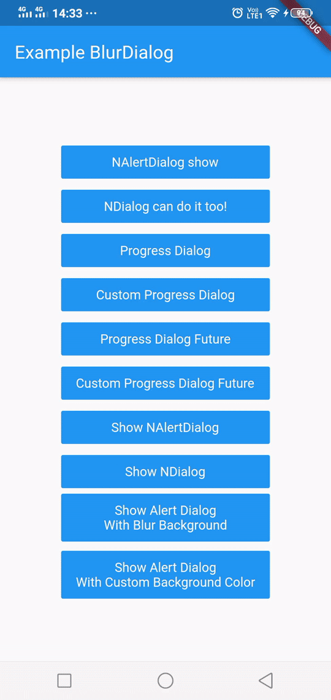

# NDialog 3.x
[](https://github.com/nizwar/ndialog/fork)&nbsp; [](https://github.com/nizwar/ndialog/star)&nbsp; [](https://github.com/nizwar/ndialog/)&nbsp; [](https://pub.dev/packages/ndialog)&nbsp; [](https://pub.dev/packages/ndialog#-example-tab-)

Custom dialog with blur background, popup animation and progressDialog with native style.

Not only helps you display dialog with a blurred background, NDialog is here to help you do many things. for example, with NDialog you can display `ProgressDialog` to the user once until it meets the end of `Future`!

First of all, let's leave the old style with showDialog(blablabla), with NDialog i provide dialog extensions, you just simply call `.show(context)` at the end of your dialog and let the magic work!

There are 2 types of dialogs in here, they are Dialog (popup dialog) and Progress Dialog.

## Dialog
In Dialog, there are 2 types too, they are `NDialog` and `NAlertDialog`.

### NDialog
Is a raw dialog where you can view them right away without anything else
``` dart
  await NDialog(
    dialogStyle: DialogStyle(titleDivider: true),
    title: Text("Hi, This is NDialog"),
    content: Text("And here is your content, hoho... "),  
    actions: <Widget>[
      FlatButton(child: Text("You"),onPressed: () {}),
      FlatButton(child: Text("Are"),onPressed: () {}),
      FlatButton(child: Text("Awesome"),onPressed: () {}),
    ],
  ).show(context);
```

### NAlertDialog
Is a dialog where you can directly set the background attributes without be wrapped by `DialogBackground` and you can simply display them.

``` dart
  await NAlertDialog(
    dialogStyle: DialogStyle(titleDivider: true),
    title: Text("Hi, This is NAlertDialog"),
    content: Text("And here is your content, hoho... "), 
    actions: <Widget>[
      FlatButton(child: Text("You"),onPressed: () {}),
      FlatButton(child: Text("Are"),onPressed: () {}),
      FlatButton(child: Text("Awesome"),onPressed: () {}),
    ],
  ).show(context);
``` 

 

## Progress Dialog
In ProgressDialog, there are 2 types too, they are `ProgressDialog` and `CustomProgressDialog`.

### ProgressDialog
Will display the ProgressDialog with Android native style.

``` dart
  ProgressDialog progressDialog = ProgressDialog(context, 
    message:Text("This is the message"), 
    title:Text("This is the title")
  );

  //You can set Message using this function
  progressDialog.setTitle(Text("Loading"));
  progressDialog.setMessage(Text("Please Wait, Injecting your phone with my virus"));
  progressDialog.show();

  await Future.delayed(Duration(seconds: 5));

  //Progress Dialog already show? don't worry, you can change the message :D
  progressDialog.setTitle(Text("Just Kidding"));
  progressDialog.setMessage(Text("I mean, virus of love :*"));

  await Future.delayed(Duration(seconds: 5));

  progressDialog.dismiss();
```

### CustomProgressDialog
Will display a progress dialog with customizable widgets

``` dart
  CustomProgressDialog progressDialog = CustomProgressDialog(context,blur: 10);

  ///You can set Loading Widget using this function
  progressDialog.setLoadingWidget(CircularProgressIndicator(valueColor: AlwaysStoppedAnimation(Colors.red)));
  progressDialog.show();

  await Future.delayed(Duration(seconds: 5));

  //Progress Dialog already show? don't worry, you can change the loading widget :D
  progressDialog.setLoadingWidget(null);

  await Future.delayed(Duration(seconds: 5));

  progressDialog.dismiss();
```

This is what I'm talking about, Each Progress Dialog has a `.future(context)` static function, which will help you display the progress dialog once until `Future` is completed

```dart

///ProgressDialog
await ProgressDialog.future(
  context, 
  future: Future.delayed(Duration(seconds: 5), () {
    return "HIYAAA";
  }),
  message: Text("Please Wait"),
  cancelText: Text("Batal"),
  title: Text("Loging in"),
)

///CustomProgressDialog
await CustomProgressDialog.future(
  context,
  future: Future.delayed(Duration(seconds: 5), () {
    return "WOHOOO";
  }),
  loadingWidget: Center(
    child: Container(
      alignment:Alignment.center, 
      child:CircularProgressIndicator(),
    ),
  ),
  backgroundColor: Colors.blue.withOpacity(.5),
)

```

## Dialog Extensions!
You can simply call `show(context)` at the end of Flutter's built-in dialogs.

```dart
  AlertDialog( ... ).show(context);
  SimpleDialog( ... ).show(context);
  Dialog( ... ).show(context);
  CupertinoDialog( ... ).show(context);
  CupertinoAlertDialog( ... ).show(context);
```

## DialogBackground
You can use DialogBackground to create your own custom dialog and display them easily, not only that, you can also change the barrierColor / background color and add little bit blur effects there.

Note : BlurDialogBackground is depreceted, use `DialogBackground` instead!

``` dart
  await DialogBackground(
    dialog: AlertDialog(
      title: Text("Alert Dialog"),
      content: Text("Wohoo.. This is ordinary AlertDialog with Blur background"),
      actions: <Widget>[
        FlatButton(child: Text("You")onPressed: () {}),
        FlatButton(child: Text("Are")onPressed: () {}),
        FlatButton(child: Text("Awesome")onPressed: () {}),
      ],
    ),
  ).show(context); 
``` 

## Screenshot
